### 入门

**Hadoop优势**

1. 高可靠性
2. 高拓展性
3. 高效性
4. 高容错性

**Hadoop组成**

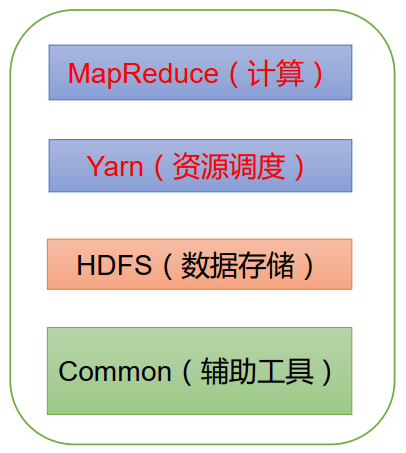

**HDFS架构概述**


**YARN架构概述**
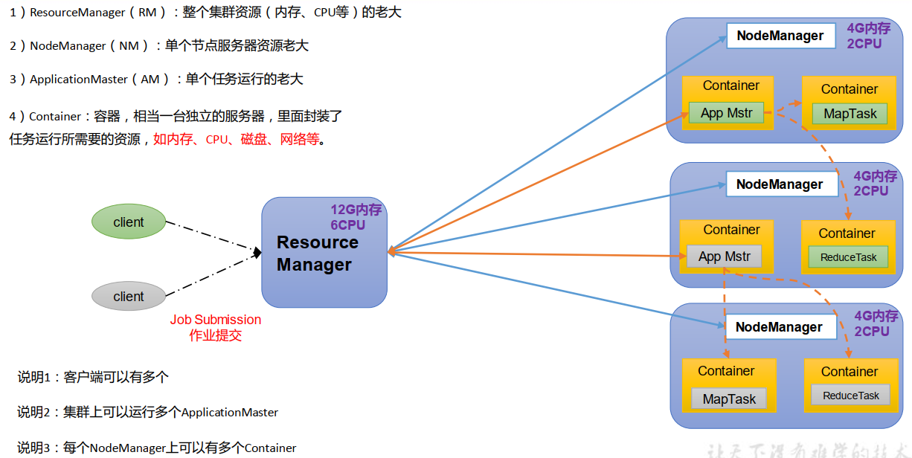

**HDFS、YARN、MapReduce三者之间的关系**

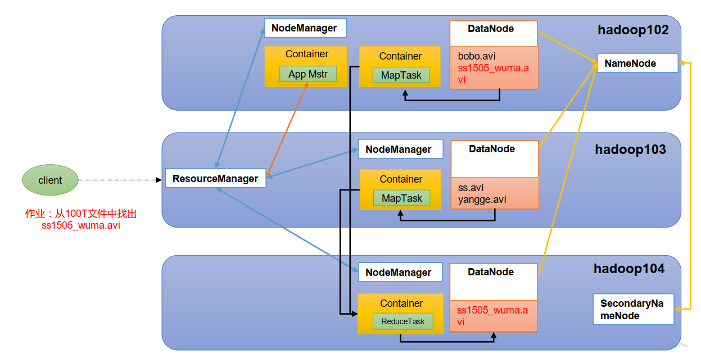

#### Hadoop运行环境搭建

##### 在所有主机上安装JDK

```shell
#将JDK放到某个位置，然后解压
tar -zxvf jdk-8u212-linuxx64.tar.gz -C /opt/module/

#然后在~/.bashrc文件中加入Java环境变量，然后执行一下
#source ~/.bashrc命令
#JAVA_HOME
export JAVA_HOME=/opt/module/jdk1.8.0_212
export PATH=$PATH:$JAVA_HOME/bin

#检查是否安装成功
java -version
```

##### 安装Hadoop

```shell
#解压
tar -zxvf hadoop-3.1.3.tar.gz -C
/opt/module/

#配置环境变量
#HADOOP_HOME
export HADOOP_HOME=/opt/module/hadoop-3.1.3
export PATH=$PATH:$HADOOP_HOME/bin
export PATH=$PATH:$HADOOP_HOME/sbin

#测试是否安装成功
hadoop version
```

##### SSH无密钥登陆

```shell
#首先在~/.ssh目录下，生成私钥id_rsa和公钥id_ras.pub
#rm ./id_rsa* 如果之前存在钥匙可删除
ssh-keygen -t rsa

#将公钥拷贝到目标机器上（包括本机）
ssh-copy-id hadoop1
ssh-copy-id hadoop2
ssh-copy-id hadoop3

#上述操作需要在hadoop1,hadoop2,hadoop3上分别执行一遍
#SSH本身不允许root登陆，需要做下面修改
#vim /etc/ssh/sshd_config
#LoginGraceTime 120
#PermitRootLogin yes
#StrictModes yes
```

##### 集群配置

*NameNode, SecondaryNameNode, ResourceManager分别装在不同的机器上*

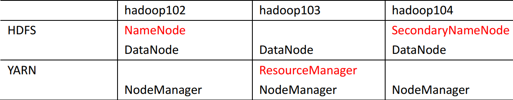


配置core-site.xml,hdfs-site.xml,yarn-site.xml,mapred-site.xml，看文档**Hadoop配置文件.md**


配置workers

```shell
vim hadoop-3.1.3/etc/hadoop/workers
#把DataNode的主机名写上
#hadoop101
#hadoop102
#hadoop103
```


**然后将Hadoop这一整个的文件夹用xsync脚本进行分发**

##### 启动集群

（1）如果是第一次启动，那么需要格式化NameNode

```shell
#在配置NameNode的节点上
hdfs namenode -format
```

*格式化NameNode，会产生新的集群id，导致NameNode和DataNode的集群id不一致，集群找不到以往的数据。如果在集群运行时需要格式化，一定要先停止NameNode和DataNode进程，再删除data和logs目录，最后进行格式化。*

（2）在配置了NameNode的节点启动HDFS

```shell
./sbin/start-dfs.sh
```

（3）在配置了ResourceManager的节点启动yarn

```shell
./sbin/start-yarn.sh
```

（4）WEB端查看

HDFS: hadoop101:9870

YARN: hadoop102:8088 

### HDFS

hdfs适合一次写入，多次读出的场景

#### 优缺点

优点：

1. 高容错性
2. 适合处理大数据
3. 可构建在廉价机器上，通过多副本机制提高可靠性

缺点：

1. 不适合低延时数据访问

2. 无法高效的对大量小文件进行存储

   1. 存储大量小文件，它们会占用NameNode的内存来存储文件目录和块信息
   2. 小文件存储的寻址时间会超过读取时间

3. 不支持并发写入和文件随机修改

   一个文件只能有一个写，不支持多线程同时写。

   仅支持数据append（追加），不支持随机修改

#### HDFS组成架构

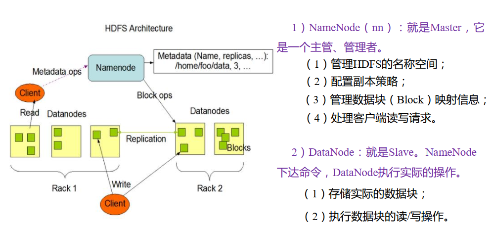

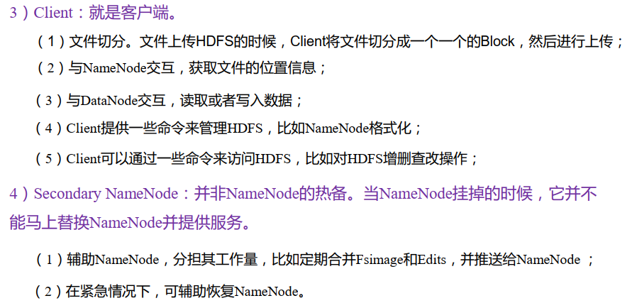


#### API操作

**将winutils中的bin放在一个无中文目录，并配置bin位置环境变量**

导入maven依赖

```xml
<dependency>
            <groupId>org.apache.hadoop</groupId>
            <artifactId>hadoop-common</artifactId>
            <version>3.1.3</version>
        </dependency>
        <dependency>
            <groupId>org.apache.hadoop</groupId>
            <artifactId>hadoop-client</artifactId>
            <version>3.1.3</version>
        </dependency>
        <dependency>
            <groupId>org.apache.hadoop</groupId>
            <artifactId>hadoop-hdfs</artifactId>
            <version>3.1.3</version>
        </dependency>
   <dependency>
                   <groupId>com.google.guava</groupId>
                  <artifactId>guava</artifactId>
                    <version>24.0-jre</version>
              </dependency>
        <dependency>
            <groupId>org.apache.hadoop</groupId>
            <artifactId>hadoop-hdfs-client</artifactId>
            <version>3.1.3</version>
        </dependency>
        <dependency>
            <groupId>junit</groupId>
            <artifactId>junit</artifactId>
            <version>4.12</version>
        </dependency>
        <dependency>
            <groupId>org.slf4j</groupId>
            <artifactId>slf4j-log4j12</artifactId>
            <version>1.7.30</version>
        </dependency>
```

在main文件夹下的resouces文件夹下创建文件log4j.properties，并加入下列内容

```
log4j.rootLogger=INFO, stdout
log4j.appender.stdout=org.apache.log4j.ConsoleAppender
log4j.appender.stdout.layout=org.apache.log4j.PatternLayout
log4j.appender.stdout.layout.ConversionPattern=%d %p [%c] - %m%n
log4j.appender.logfile=org.apache.log4j.FileAppender
log4j.appender.logfile.File=target/spring.log
log4j.appender.logfile.layout=org.apache.log4j.PatternLayout
log4j.appender.logfile.layout.ConversionPattern=%d %p [%c] - %m%n
```

#### HDFS的写数据流程

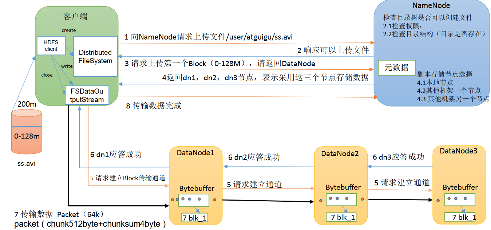

写过程，第7步的一个较详细解释

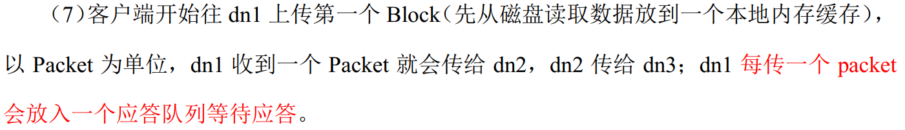

**节点距离计算**

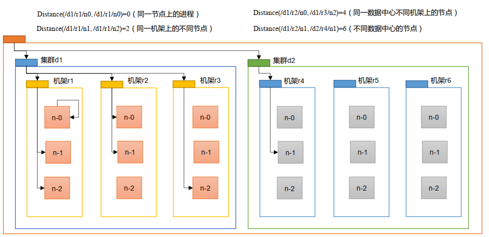

##### 副本节点选择

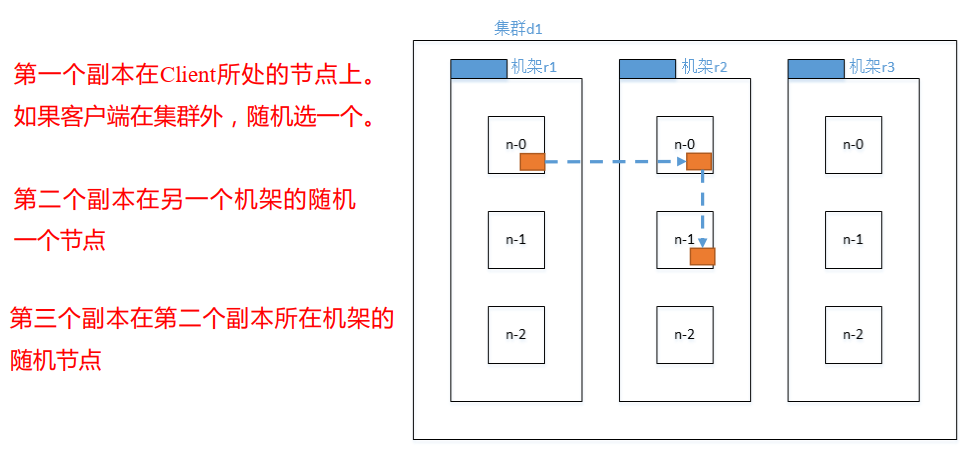

#### HDFS读数据流程

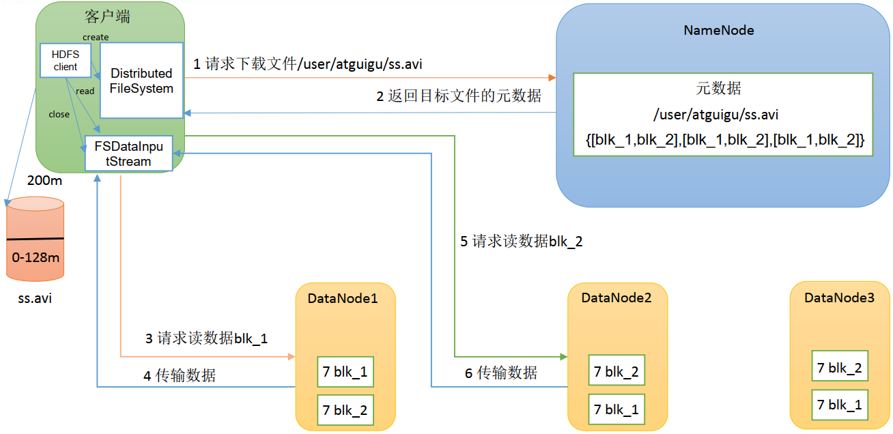

#### NameNode和SecondaryNameNode

##### NameNode工作机制

*第一次启动NameNode，格式化之后会创建Fsimage和Edits文件*

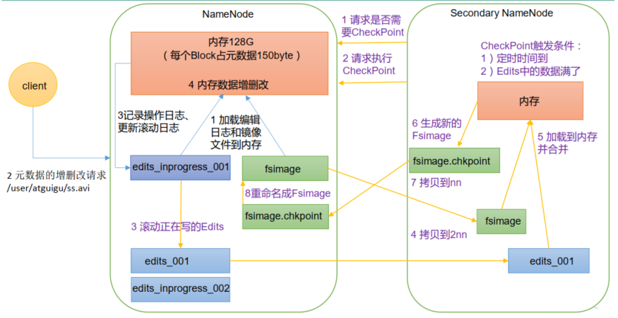

##### Fsimage和Edits

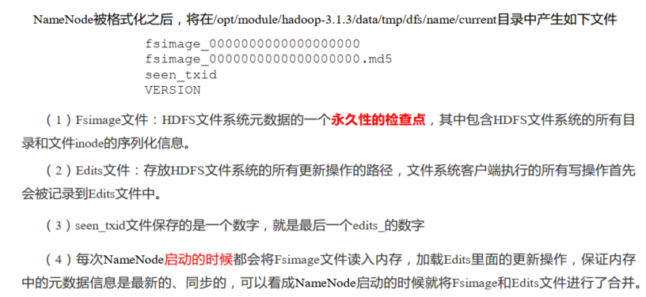

可用oiv查看fsimage文件

可用oev查看edits文件

##### CheckPoint时间设置

（1）通常情况下，SecondaryNameNode每隔一小时执行一次

```xml
#hdfs-defalut.xml
<property>
<name>dfs.namenode.checkpoint.period</name>
<value>3600s</value>
</property>
```

（2）一分钟检查一次操作次数，当操作次数达到1百万时，SecondaryNameNode执行一次

```xml
#hdfs-default.xml
<property>
<name>dfs.namenode.checkpoint.txns</name>
<value>1000000</value>
<description>操作动作次数</description>
</property>
<property>
<name>dfs.namenode.checkpoint.check.period</name>
<value>60s</value>
<description> 1 分钟检查一次操作次数</description>
</property>

```

#### DataNode

##### DataNode工作机制

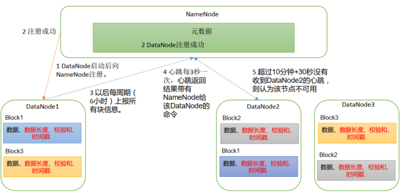

一个数据块在DataNode上以文件形式存储在磁盘上，包括两个文件，一个数据本身，一个是元数据包括数据块的长度、校验和以及时间戳。

DN向NN上报所有块信息的时间间隔默认是6小时

```xml
<property>
<name>dfs.blockreport.intervalMsec</name>
<value>21600000</value>
<description>Determines block reporting interval in
milliseconds.</description>
</property>
```

DN扫描自己节点块信息列表的时间，默认6小时

```xml
<property>
<name>dfs.datanode.directoryscan.interval</name>
<value>21600s</value>
<description>Interval in seconds for Datanode to scan data
directories and reconcile the difference between blocks in memory and on
the disk.
Support multiple time unit suffix(case insensitive), as described
in dfs.heartbeat.interval.
</description>
</property>
```

##### 数据完整性

DataNode保证数据完整性的方法：

1. 当DataNode读取Block时，计算其CheckSum
2. 如果计算的CheckSum与Block创建时的CheckSum不一致，则Block损坏
3. Client读取其他DataNode上的Block
4. 常见的校验算法：crc,md5,shal
5. DataNode在其文件创建后周期验证CheckSum

##### 掉线时限参数设置

超时时长TimeOut计算公式：

TimeOut=2 * dfs.namenode.heartbeat.recheck.interval + 10 * dfs.heartbeat.interval

*dfs.namenode.heartbeat.recheck.interval默认大小5分钟*

*dfs.heartbeat.interval默认大小3秒*

**在hdfs-site.xml文件中，dfs.namenode.heartbeat.recheck.interval的单位为毫秒，dfs.heartbeat.interval单位为秒**

```xml
<property>
<name>dfs.namenode.heartbeat.recheck-interval</name>
<value>300000</value>
</property>
<property>
<name>dfs.heartbeat.interval</name>
<value>3</value>
</property>
```

### MapReduce

#### 优缺点

1.优点：

- 易于编程
- 良好的拓展性
- 高容错性
- 适合PB级以上海量数据的离线处理

2.缺点

- 不擅长实时计算
- 不擅长流式计算：流式计算的数据是动态的，而MR的输入数据是静态的
- 不擅长DAG（有向无环图）计算：这个计算是多个应用程序存在依赖关系，后一个应用程序的输入为前一个的输出。MR也可以做，只不过每个MR的输出结果都会写到磁盘，会造成大量的磁盘IO，效率低。

#### MR进程

MR分布式运行时有三类实例进程：

- MrAppMaster：负责整个程序的过程调度和状态协调
- MapTask：负责Map阶段数据处理
- ReduceTask：负责Reduce阶段数据处理

#### 常用数据序列化类型

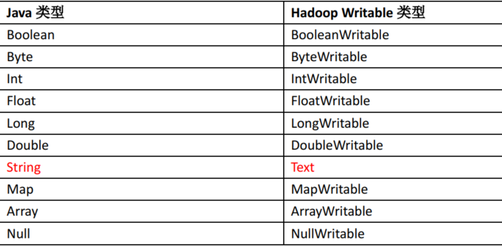

#### WordCount示例

Mapper：

```java
public class MyMapper extends Mapper<LongWritable, Text, Text, IntWritable> {

    Text K = new Text();
    IntWritable V = new IntWritable();
    @Override
    protected void map(LongWritable key, Text value, Mapper<LongWritable, Text, Text, IntWritable>.Context context) throws IOException, InterruptedException {
        String line = value.toString();
        String[] words = line.split(" ");
        for (String word : words) {
            K.set(word);
            V.set(1);
            context.write(K,V);
        }
    }
}
```

Reducer：

```java
public class MyReducer extends Reducer<Text, IntWritable, Text, IntWritable> {

    int sum;
    IntWritable v = new IntWritable();
    @Override
    protected void reduce(Text key, Iterable<IntWritable> values, Reducer<Text, IntWritable, Text, IntWritable>.Context context) throws IOException, InterruptedException {
        sum =0;
        for (IntWritable value : values) {
            sum += value.get();
        }
        v.set(sum);
        context.write(key,v);
    }
}
```

Driver：

```java
public class Driver {

    public static void main(String[] args) throws IOException, InterruptedException, ClassNotFoundException, URISyntaxException {

        Configuration conf = new Configuration();
        Job job = Job.getInstance(conf);

        job.setJarByClass(Driver.class);

        job.setMapperClass(MyMapper.class);
        job.setReducerClass(MyReducer.class);

        job.setMapOutputKeyClass(Text.class);
        job.setMapOutputValueClass(IntWritable.class);
        job.setOutputKeyClass(Text.class);
        job.setOutputValueClass(IntWritable.class);

        FileSystem fs = FileSystem.get(new URI("hdfs://hadoop101:8020"), conf, "root");
        fs.delete(new Path("/data/result"),true);

        FileInputFormat.setInputPaths(job, new Path("hdfs://hadoop101:8020/data"));
        FileOutputFormat.setOutputPath(job, new Path("hdfs://hadoop101:8020/data/result"));

        boolean result = job.waitForCompletion(true);
        System.exit(result?0:1);

    }
}
```

#### Hadoop序列化

##### 自定义bean对象实现序列化接口（Writable）

1. 实现Writable接口
2. 空参构造函数
3. 重写序列化方法write
4. 重写反序列化方法readFields
5. 序列化和反序列化的顺序要相同

```java
public class FlowBean implements Writable {
    private long upFlow;
    private long downFlow;
    private long sumFlow;

    public FlowBean(){}

    @Override
    public void write(DataOutput out) throws IOException {
        out.writeLong(upFlow);
        out.writeLong(downFlow);
        out.writeLong(sumFlow);
    }

    @Override
    public void readFields(DataInput in) throws IOException {
        upFlow = in.readLong();
        downFlow = in.readLong();
        sumFlow = in.readLong();
    }

    @Override
    public String toString() {
        return "FlowBean{" +
                "upFlow=" + upFlow +
                ", downFlow=" + downFlow +
                ", sumFlow=" + sumFlow +
                '}';
    }

    public long getUpFlow() {
        return upFlow;
    }

    public void setUpFlow(long upFlow) {
        this.upFlow = upFlow;
    }

    public long getDownFlow() {
        return downFlow;
    }

    public void setDownFlow(long downFlow) {
        this.downFlow = downFlow;
    }

    public long getSumFlow() {
        return sumFlow;
    }

    public void setSumFlow(long sumFlow) {
        this.sumFlow = sumFlow;
    }
}
```

Mapper：

```java
public class FlowMapper extends Mapper<LongWritable, Text, Text, FlowBean> {

    Text K = new Text();
    FlowBean V = new FlowBean();

    @Override
    protected void map(LongWritable key, Text value, Mapper<LongWritable, Text, Text, FlowBean>.Context context) throws IOException, InterruptedException {
        String line = value.toString();
        String[] items = line.split("\t");

        K.set(items[1]);

        V.setUpFlow(Long.parseLong(items[items.length - 3]));
        V.setDownFlow(Long.parseLong(items[items.length - 2]));
        V.setSumFlow(0L);

        context.write(K,V);

    }
}
```

Reducer：

```java
public class FlowReducer extends Reducer<Text, FlowBean, Text, FlowBean> {

    FlowBean V = new FlowBean();
    @Override
    protected void reduce(Text key, Iterable<FlowBean> values, Reducer<Text, FlowBean, Text, FlowBean>.Context context) throws IOException, InterruptedException {
        Long totalUp = 0L;
        Long totalDown = 0L;

        for (FlowBean value : values) {
            totalUp += value.getUpFlow();
            totalDown += value.getDownFlow();
        }

        V.setUpFlow(totalUp);
        V.setDownFlow(totalDown);
        V.setSumFlow(totalDown + totalUp);
        context.write(key, V);

    }
}
```

Driver：

```java
public class FlowDriver {

    public static void main(String[] args) throws IOException, InterruptedException, ClassNotFoundException, URISyntaxException {

        Configuration conf = new Configuration();
        Job job = Job.getInstance(conf);

        job.setJarByClass(FlowDriver.class);

        job.setMapperClass(FlowMapper.class);
        job.setReducerClass(FlowReducer.class);

        job.setMapOutputValueClass(FlowBean.class);
        job.setMapOutputKeyClass(Text.class);
        job.setOutputKeyClass(Text.class);
        job.setOutputValueClass(FlowBean.class);

        FileSystem fs = FileSystem.get(new URI("hdfs://hadoop101:8020"), conf);
        fs.delete(new Path("/data/result"),true);
        fs.close();
        FileInputFormat.addInputPath(job,new Path("hdfs://hadoop101:8020/data/phone"));
        FileOutputFormat.setOutputPath(job,new Path("hdfs://hadoop101:8020/data/result"));

        boolean b = job.waitForCompletion(true);

        System.exit(b?0:1);

    }
}
```

#### InputFormat数据输入

##### 切片与MapTask并行度机制

数据切片是在逻辑上对输入进行切片，一个切片启动一个MapTask。

MapTask并行度由client提交Job时的切片数决定。

默认情况下，切片大小=BlockSize

##### Job提交流程源码

```java
waitForCompletion()
submit();
// 1 建立连接
connect();
// 1）创建提交 Job 的代理
new Cluster(getConfiguration());
// （1）判断是本地运行环境还是 yarn 集群运行环境
initialize(jobTrackAddr, conf);
// 2 提交 job
submitter.submitJobInternal(Job.this, cluster)
// 1）创建给集群提交数据的 Stag 路径
Path jobStagingArea = JobSubmissionFiles.getStagingDir(cluster, conf);
// 2）获取 jobid ，并创建 Job 路径
JobID jobId = submitClient.getNewJobID();
// 3）拷贝 jar 包到集群
copyAndConfigureFiles(job, submitJobDir);
rUploader.uploadFiles(job, jobSubmitDir);
// 4）计算切片，生成切片规划文件
writeSplits(job, submitJobDir);
maps = writeNewSplits(job, jobSubmitDir);
input.getSplits(job);
// 5）向 Stag 路径写 XML 配置文件
writeConf(conf, submitJobFile);
conf.writeXml(out);
// 6）提交 Job,返回提交状态
status = submitClient.submitJob(jobId, submitJobDir.toString(),job.getCredentials());
```

##### FileInputFormat切片源码解析(getSplits(job))

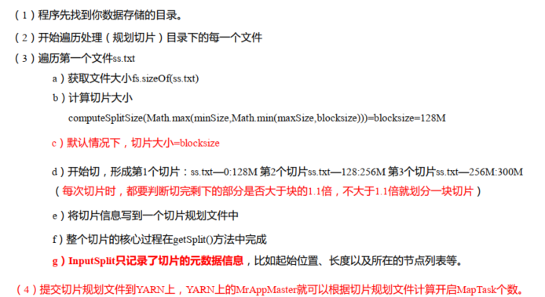

##### TextInputFormat

TextInputFormat是默认的FileInputFormat实现类。按行读取，键是每行的偏移量，值是每行的数据。Text类型

##### CombineTextInputFormat

默认的TextInputFormat，不管文件多小，都会是一个单独的切片，都会对应启动一个MapTask，效率极低。

CombineTextInputFormat用于小文件过多的场景，它将多个小文件从逻辑上划分到一个切片，并交给一个MapTask处理。

虚拟存储切片最大值设置：

```java
CombineTextInputFormat.setMaxInputSplitSize();
```

###### CombineTextInputFormat切片机制

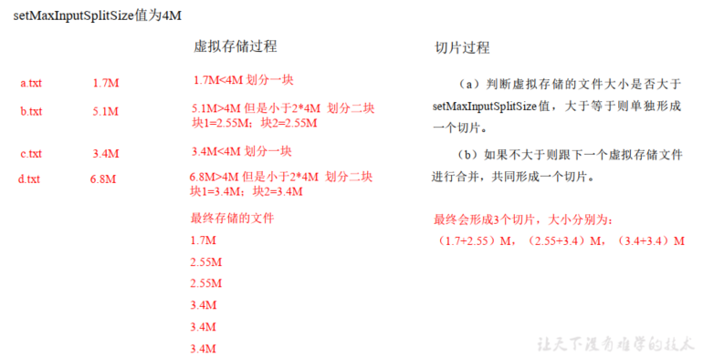

*如果输入文件大于设置的最大值的两倍，那么以最大值切割一块。*

###### 代码

```java
#例如在wordCount中，只需要加入
job.setInputFormatClass(CombineTextInputFormat.class);
        CombineTextInputFormat.setMaxInputSplitSize(job,xxxxx);
```

#### MapReduce工作流程

##### Map阶段

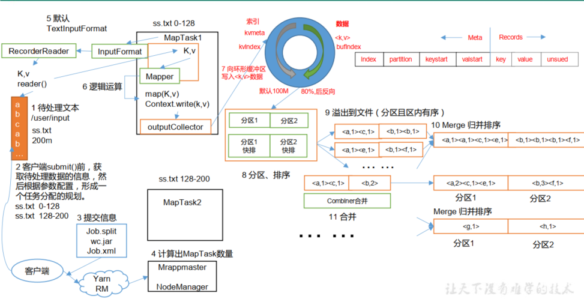

##### Reduce阶段

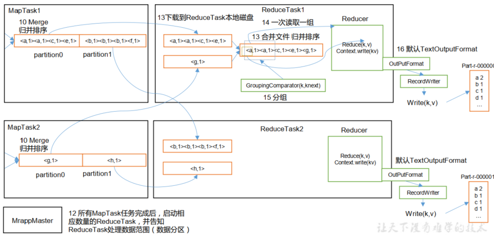

Shuffle过程是从Mapper之后，Reducer之前

##### Partition分区

###### 默认Partirioner分区

```java
public class HashPartitioner<K, V> extends Partitioner<K, V> {

  public int getPartition(K key, V value,
                          int numReduceTasks) {
    return (key.hashCode() & Integer.MAX_VALUE) % numReduceTasks;
  }

}
```

###### 自定义Partitioner

（1）继承Partitioner，重写getParition（）

```java
public class MyPartitioner extends Partitioner<Mapper输出键, Mapper输出值> {

    @Override
    public int getPartition(Text text, FlowBean flowBean, int numPartitions) {
        //控制分区逻辑
        。。。。。
        return partition；
    }
}
```

（2）Job驱动中设置

```java
job.setPartitionerClass(MyPartitioner.class);
```

（3）根据自定义Partitioner逻辑设置ReduceTask数

```java
job.setNumReduceTasks(5);
```

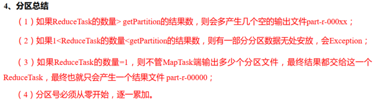

##### WritableComparable排序

###### 排序分类

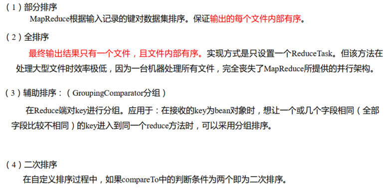

###### 自定义排序WritableComparable

bean对象作为Mapper输出key传输，需要实现WritableComparable接口，重写compareTo

```java
public class FlowBean implements WritableComparable<FlowBean> {
    private long upFlow; //上行流量
private long downFlow; //下行流量
private long sumFlow; //总流量
@Override
    public int compareTo(@NotNull FlowBean o) {
        //按照总流量比较,倒序排列
if(this.sumFlow > o.sumFlow){
return -1;
}else if(this.sumFlow < o.sumFlow){
return 1;
}else {
return 0;
}
    }
    @Override
    public void write(DataOutput out) throws IOException {
        out.writeLong(upFlow);
        out.writeLong(downFlow);
        out.writeLong(sumFlow);
    }

    @Override
    public void readFields(DataInput in) throws IOException {
        upFlow = in.readLong();
        downFlow = in.readLong();
        sumFlow = in.readLong();
    }
}
```

##### Combiner合并

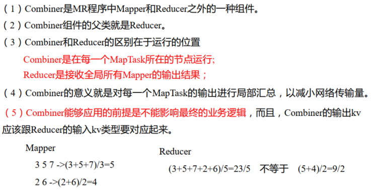

###### 自定义Combiner

（1）继承Reducer，重写reduce方法

（2）job.setCombinerClass(WordCountCombiner.class)

#### OutputFormat

默认输出格式是TextOutputFormat

##### 自定义OutputFormat

（1）实现FileOutputFormat类（也可以是别的OutputFormat类），重写方法

（2）实现RecordWriter类，重写方法

（3）job.setOutputFormatClass()

**LogOutputFormat:**

```java
import org.apache.hadoop.io.NullWritable;
import org.apache.hadoop.io.Text;
import org.apache.hadoop.mapreduce.OutputFormat;
import org.apache.hadoop.mapreduce.RecordWriter;
import org.apache.hadoop.mapreduce.TaskAttemptContext;
import org.apache.hadoop.mapreduce.lib.output.FileOutputFormat;

import java.io.IOException;

public class LogOutputFormat extends FileOutputFormat<Text, NullWritable> {

    @Override
    public RecordWriter<Text, NullWritable> getRecordWriter(TaskAttemptContext job) throws IOException, InterruptedException {
        LogRecordWriter logRecordWriter = new LogRecordWriter(job);
        return logRecordWriter;
    }
}
```

**LogRecordWriter**

```java
import org.apache.hadoop.conf.Configuration;
import org.apache.hadoop.io.NullWritable;
import org.apache.hadoop.io.Text;
import org.apache.hadoop.mapreduce.RecordWriter;
import org.apache.hadoop.mapreduce.TaskAttemptContext;

import java.io.IOException;
import java.sql.*;

public class LogRecordWriter extends RecordWriter<Text, NullWritable> {
    private Connection conn=null;
    private PreparedStatement stmt=null;
    private int fuck_num =0;
    private int fuck_you = 0;
    public LogRecordWriter(TaskAttemptContext job) {
        try {
            Class.forName("com.mysql.jdbc.Driver");
            conn = DriverManager.getConnection("jdbc:mysql://192.168.126.128:3306/Test",
                    "root","hadoop");
            stmt = conn.prepareStatement("insert into fuck (name) values (?)");
        } catch (Exception e) {
            e.printStackTrace();
        }
    }
    @Override
    public void write(Text key, NullWritable value) throws IOException, InterruptedException {
        String log = key.toString();

        if (log.contains("atguigu")) {
            try {

                stmt.setString(1,"fuck"+(fuck_num++));
                stmt.execute();
            } catch (SQLException e) {
                e.printStackTrace();
            }
        }else{
            try {

                stmt.setString(1,"fuckyou"+(fuck_you++));
                stmt.execute();
            } catch (SQLException e) {
                e.printStackTrace();
            }
        }

    }

    @Override
    public void close(TaskAttemptContext context) throws IOException, InterruptedException {

        try {
            stmt.close();
            conn.close();
        } catch (SQLException e) {
            e.printStackTrace();
        }

    }
}
```

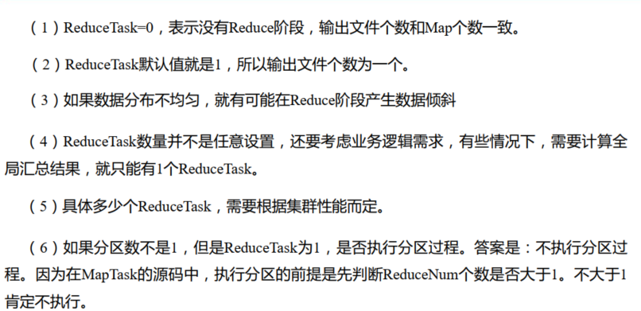

#### MapTask源码解析流程

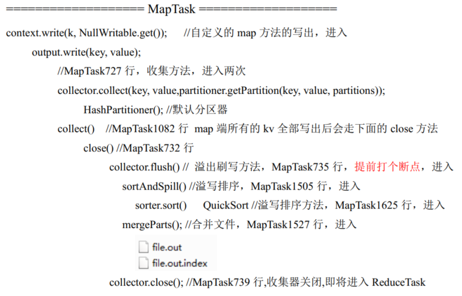

#### ReduceTask源码解析流程


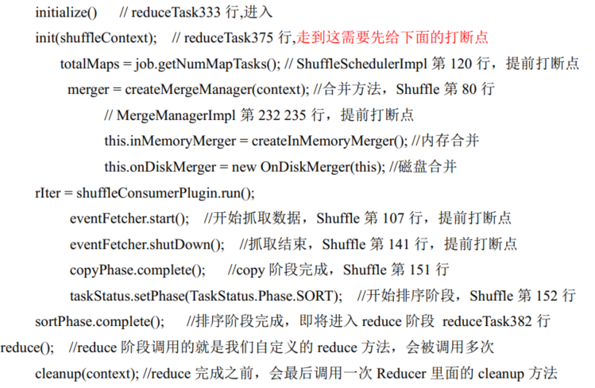

#### MapReducer开发总结

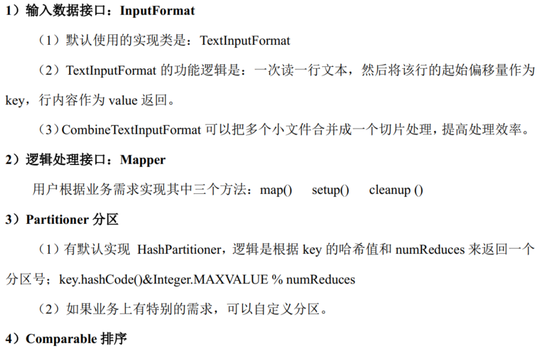

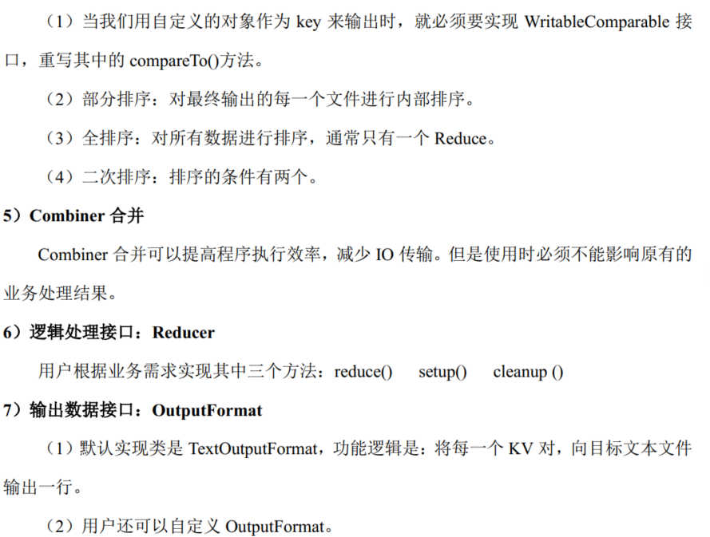

#### Hadoop数据压缩

##### 概述

（1）压缩的优缺点：

- 优点：减少磁盘IO、减少磁盘存储空间
- 缺点：增加CPU开销

（2）压缩原则

- 运算密集型的Job，少用压缩
- IO密集型的Job，所用压缩

##### MR支持的压缩编码

（1）压缩算法对比

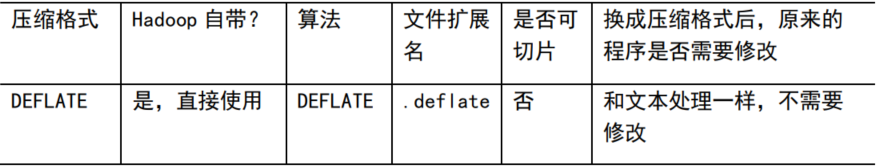

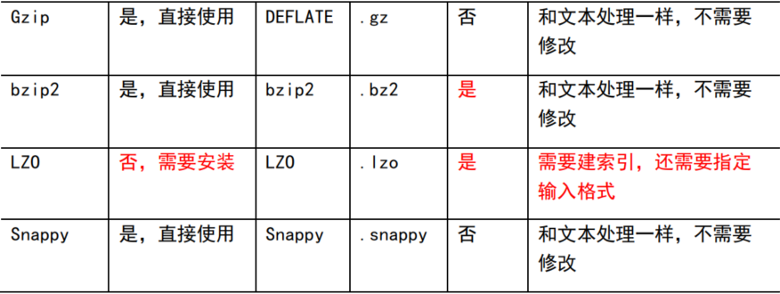

（2）压缩性能比较

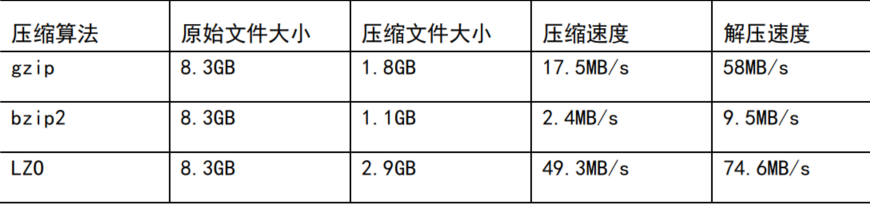

压缩方式选择时重点考虑：压缩\解压速度、压缩率、压缩后是否支持切片

（3）压缩位置选择

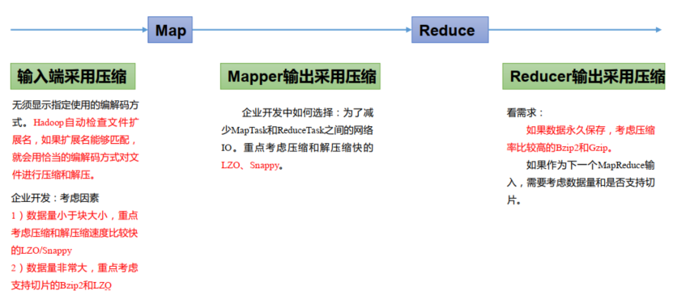

##### 压缩参数配置

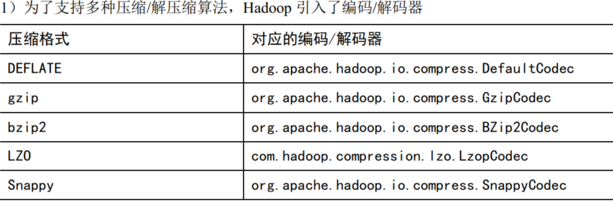

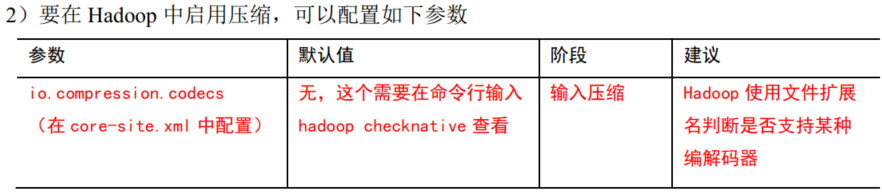

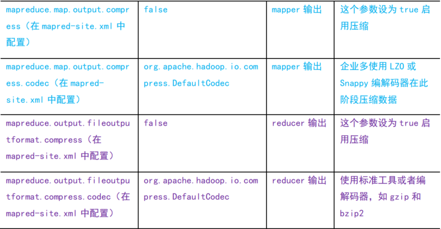

##### 压缩案例

（1）在Mapper输出端压缩

```java
// 在Job中设置，其余Mapper，Reducer不变
// 开启 map 端输出压缩
conf.setBoolean("mapreduce.map.output.compress", true);
// 设置 map 端输出压缩方式
conf.setClass("mapreduce.map.output.compress.codec",
BZip2Codec.class,CompressionCodec.class);
```

（2）在Reducer输出端压缩

```java
// 在Job中设置，Mapper，Reducer不变
// 设置reduce端输出压缩开启
FileOutputFormat.setCompressOutput(job, true);
// 设置压缩的方式
FileOutputFormat.setOutputCompressorClass(job,BZip2Codec.class)
```

